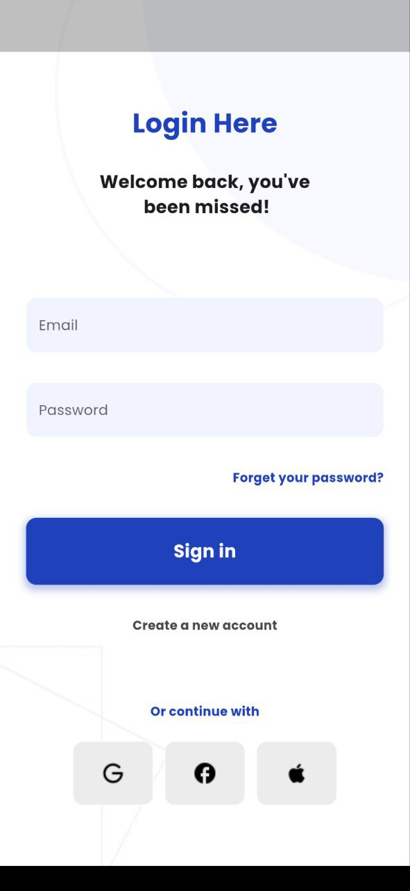
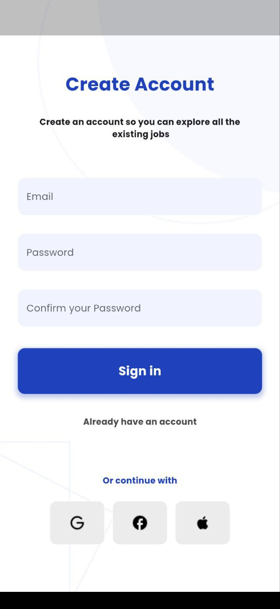

# Flutter Onboarding, Register, and Login UI

This Flutter app provides a clean and modern UI for onboarding, registration, and login screens.

## Features

- **Welcome Screen**: Introduces the app.
- **Login Screen**: Allows users to log in with their email and password.
- **Registration Screen**: Enables new users to create an account.
- **Fixed Background**: Ensures a consistent visual experience with a fixed background image.

## Screenshots





## Getting Started

### Prerequisites

- Flutter SDK
- Android Studio or Visual Studio Code

### Installation

1. **Clone the repository**:

    ```sh
    git clone https://github.com/kodjozecodeur/onboarding_login_register_ui.git
    cd flutter-onboarding_login_register_ui
    ```

2. **Install dependencies**:

    ```sh
    flutter pub get
    ```

3. **Run the app**:

    ```sh
    flutter run
    ```

## Folder Structure

- `lib/`
  - `components/` - Reusable UI components like buttons and text fields.
  - `screens/` - Contains all the screen widgets (onboarding, login, register).
  - `main.dart` - The main entry point of the application.

## Credits

The design of this project belongs to Tugane Amiel (@toonation):

- [Figma Community](https://www.figma.com/@toonation)
- [Twitter](https://twitter.com/tugane4)

## Contact

For any questions or suggestions, feel free to reach out to [samuelmaglodji@gmail.com].
